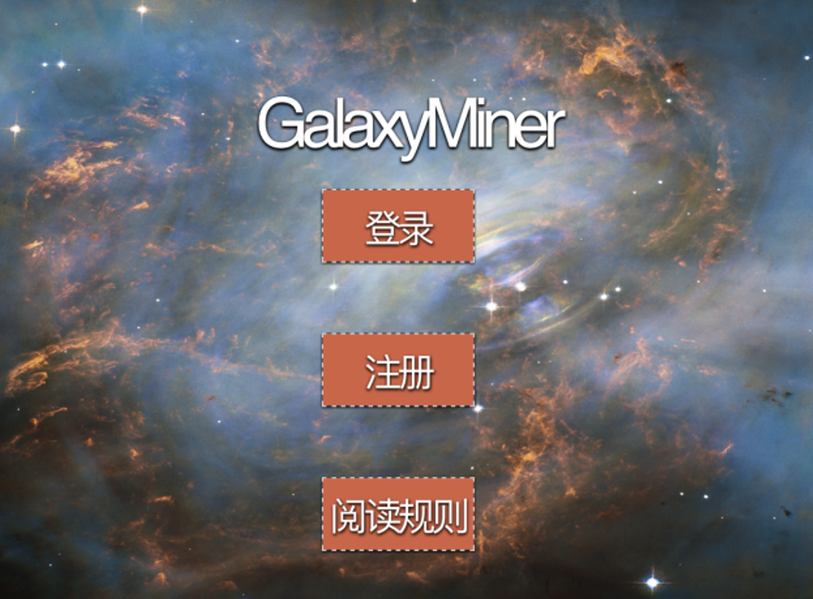

# C-Project-Game-GoldenMiner-
This project is a Simple C GameProject using [EasyX Graphics Library](https://easyx.cn). 
* Redesign the UI and stroy bacground, which is about the journey of [Voyager 2](https://zh.wikipedia.org/wiki/旅行者2号). 
* Maintain the [golden miner's playing logic](https://www.xbox.com/en-US/games/store/golden-miner/bxghflrmq3q7)

这是一个简单的C语言游戏项目，使用[EasyX图形库](https://easyx.cn)。
* 重新设计了整个游戏界面和故事背景，故事背景为[旅行者2号](https://zh.wikipedia.org/wiki/旅行者2号)的太空探索
* 游戏完成逻辑依旧和[经典黄金矿工]((https://www.xbox.com/en-US/games/store/golden-miner/bxghflrmq3q7))一致。

